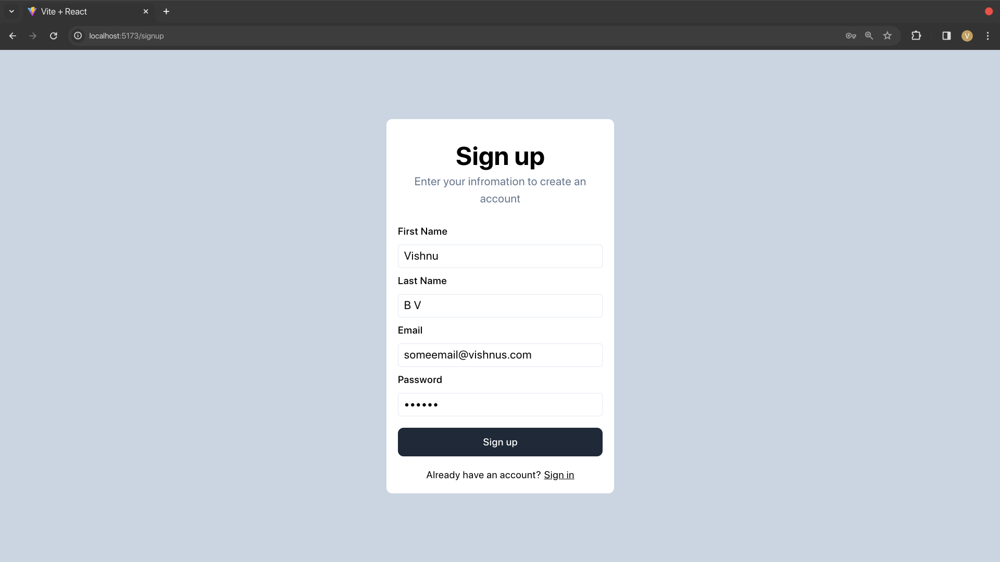
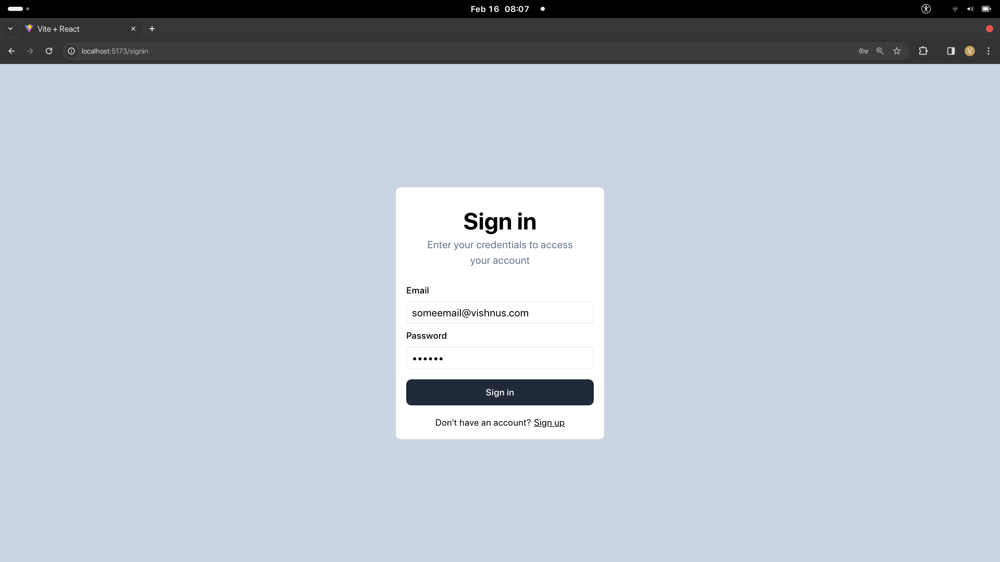
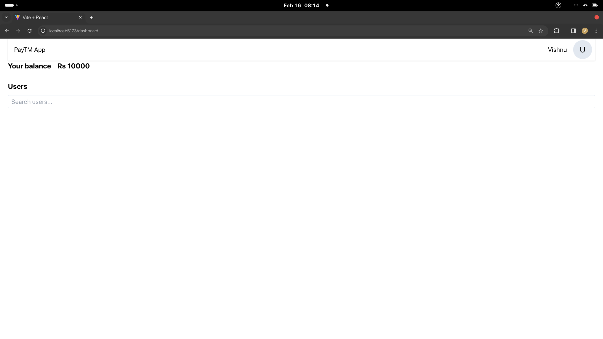
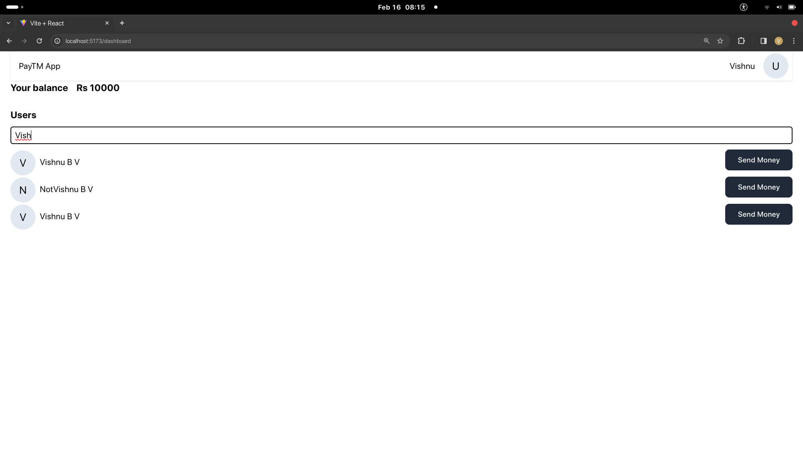
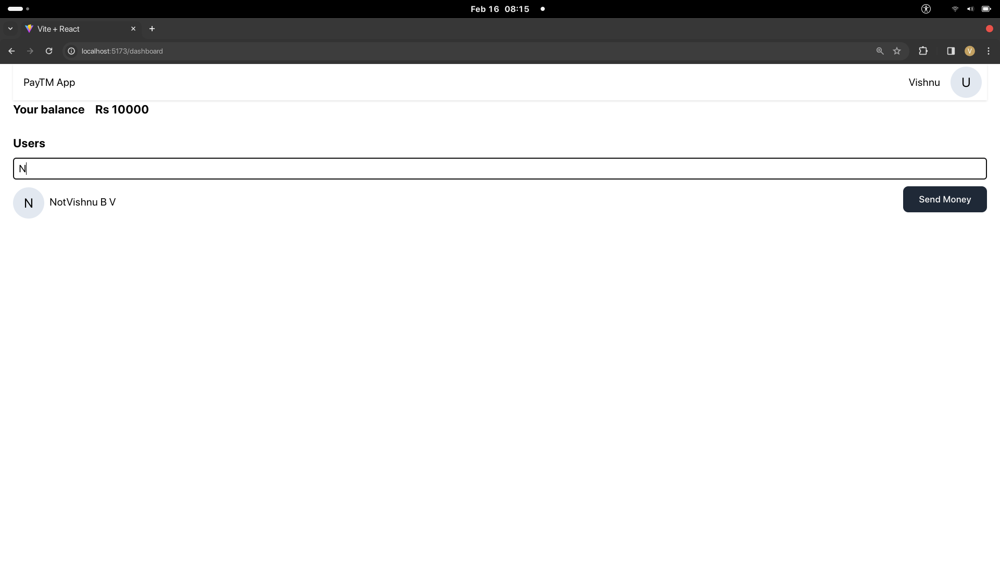
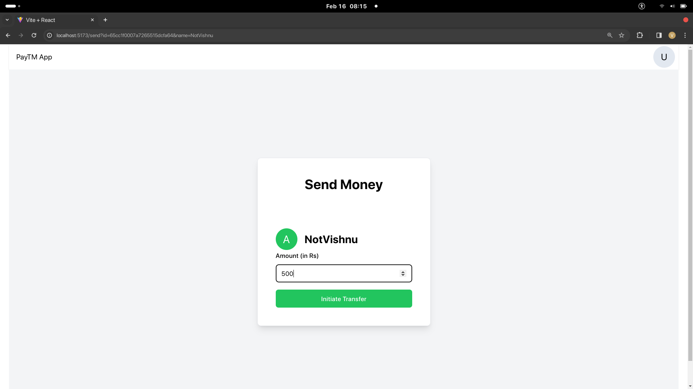
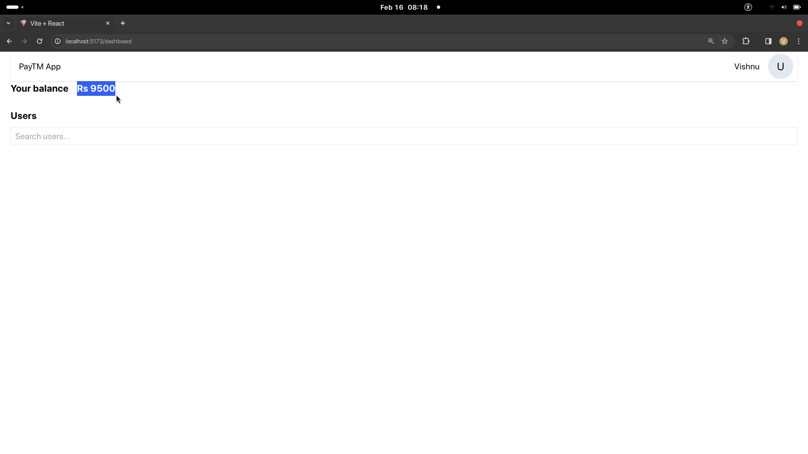

# Basic Paytm Clone

## Project Description

This project is a basic version of Paytm, focusing on simulating the transfer of money from one user to another. It includes essential features such as user authentication, money transfer functionality, user search, and more. This project was created as a hobby project to explore transactional features in databases studied during college.

## Features

- **User Authentication:**
  - Users can create accounts and log in securely.

- **Money Transfer:**
  - Transfer money seamlessly from one user to another.

- **User Search:**
  - Easily find other users to initiate transactions.

## Installation

To run this project locally, follow these steps:

1. Clone the repository:
   ```bash
   git clone https://github.com/your-username/basic-paytm-clone.git

2. Install dependencies::
   ```bash
    cd basic-paytm-clone
    npm install  # or your package manager of choice

3. Setup the database

4. Run the application
    ```bash
    npm start

## Screenshorts








